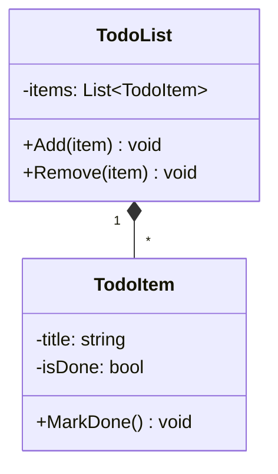

# To be done... 

## Mermade test UML

```mermaid
classDiagram
  class TodoList {
    -items: List~TodoItem~
    +Add(item) void
    +Remove(item) void
  }
  class TodoItem {
    -title: string
    -isDone: bool
    +MarkDone() void
  }
  TodoList "1" *-- "*" TodoItem
```
